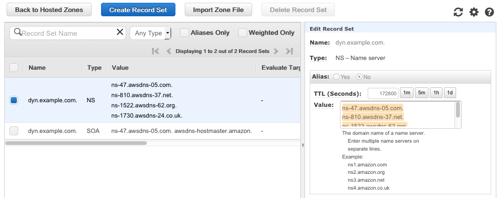

## Route 53 Setup Instructions

### Prerequisites:

* A domain you own, hosted on Route 53 or another provider.  
* You can[ register domains](https://aws.amazon.com/about-aws/whats-new/2014/07/31/amazon-route-53-announces-domain-name-registration-geo-routing-and-lower-pricing/) through Route 53 for as little as $10/year.  

### Notes:
* We use ‘example.com’ as the domain in these instructions.  Please replace it with your own domain when you set up your system.  
As noted above, we assume that you already own the primary domain, ie example.com, and the instructions focus on setting up a delegated subdomain, ie dyn.example.com.  
* Do not copy and paste from this document as the code may contain hidden characters.  Instead, use the text files included in the git repository.  

### Creating the DNS zone in Route 53

In this section, you create a DNS zone for the delegated subdomain we will use for our dynamic dns entries.  So if your domain is example.com, we will create dyn.example.com.  
The images in this section show an example.com zone.  Your main domain zone will only show here if it is hosted in Route 53.

* Log in to the AWS console.
* Go to Route 53 in the console.
* Click ‘Create Hosted Zone’
* Type ‘dyn.example.com’ in ‘Domain Name’.
* Choose ’Public Hosted Zone’ for ‘Type’.  
Note that 'Private Hosted Zones' do not support delegated subdomains.  
* Click ‘Create’.

* * *

* * *

* Click on the ‘NS’ record set and copy all the text from the ‘Value’ field in the right pane.

These are the values from our example, yours will be different.  

    ns-47.awsdns.com.  
    ns-810.awsdns-37.net.  
    ns-1522.awsdns-62.org.  
    ns-1730.awsdns-24.co.uk.  

* * *

* * *

* To create a test record for later, click ‘Create Record Set’ and populate all the fields in the right pane as illustrated below, then click ‘Create’.  

* * *

* * *

* Click on ‘Hosted zones’ in the left pane.
* Copy the ‘Hosted zone ID’ of dyn.example.com, you will need it later.
In our example, it’s ‘ZU040511OI4C4’

* * *

* * *

### Delegating the subdomain.

If your main ‘example.com’ zone is hosted in Route 53, skip to ‘Delegating the subdomain in Route 53’.

### Delegating the subdomain on other DNS providers.

If your domain is hosted elsewhere, consult your DNS provider’s documents on delegating subdomains.  Generally, you just need to create a DNS record set under the main domain where the name is ‘dyn’ the type is ‘NS’ and the value is the list of nameservers you pulled from the previous steps.
In standard Bind zonefile format this would look like:	

    dyn.example.com.	IN	NS	ns-47.awsdns.com.
    dyn.example.com.	IN	NS	ns-810.awsdns-37.net.
    dyn.example.com.	IN	NS	ns-1522.awsdns-62.org.
    dyn.example.com.	IN	NS	ns-1730.awsdns-24.co.uk.

### Delegating the subdomain in Route 53.

* Click ‘Back to Hosted Zones’
* Select the main ‘example.com’ zone, then click ‘Go to Record Sets’
* Click ‘Create Record Set’
* Populate all the fields as illustrated in the right pane below, substituting the values you copied from your new dyn.example.com domain in the ‘Value’ field.
* Click ‘Create’

* * *

* * *

### Testing the DNS setup.

If everything is setup properly, test.dyn.example.com should resolve to 1.2.3.4.

In a shell on OSX, Linux and Unix,  you can use the command line tool dig.

	dig test.dyn.example.com
	;; ANSWER SECTION:
    test.dyn.example.com.	60	IN	A	1.2.3.4

Otherwise, if you search the internet for ‘dns lookup tool’ there are many free tools you can use for a  test lookup.

