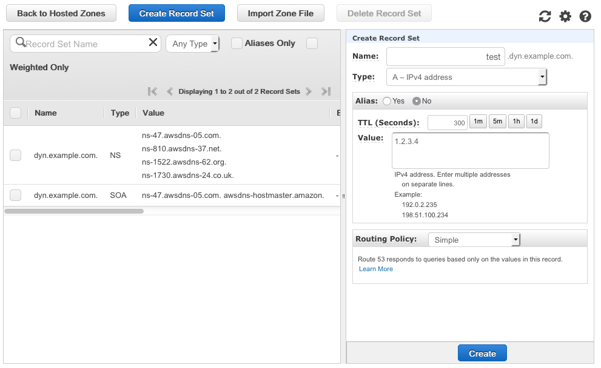

## Dynamic DNS with Lambda and Route 53 Setup Instructions

This guide will walk you through setting up this system in your own AWS account.
It is meant to supplement the [blog post](https://medium.com/aws-activate-startup-blog/building-a-serverless-dynamic-dns-system-with-aws-a32256f0a1d8) which fully describes the project. 

### Prerequisites:

* An Amazon Web Services account.  New accounts are eligible for the[ AWS Free Tier](https://aws.amazon.com/free/).
* A domain you own, hosted on Route 53 or another provider.  You can[ register domains](https://aws.amazon.com/about-aws/whats-new/2014/07/31/amazon-route-53-announces-domain-name-registration-geo-routing-and-lower-pricing/) through Route 53 for as little as $10/year.  

### Notes:
* We use ‘example.com’ as the domain in these instructions.  Please replace it with your own domain when you set up your system.  
As noted above, we assume that you already own the primary domain, ie example.com, and the instructions focus on setting up a delegated subdomain, ie dyn.example.com.  
* Do not copy and paste from this document as the code may contain hidden characters.  Instead, use the text files included in the git repository.  

### Creating the DNS zone in Route 53

In this section, you create a DNS zone for the delegated subdomain we will use for our dynamic dns entries.  So if your domain is example.com, we will create dyn.example.com.  
The images in this section show an example.com zone.  Your main domain zone will only show here if it is hosted in Route 53.

* Log in to the AWS console.
* Go to Route 53 in the console.
* Click ‘Create Hosted Zone’
* Type ‘dyn.example.com’ in ‘Domain Name’.
* Choose ’Public Hosted Zone’ for ‘Type’.
* Click ‘Create’.

* * *

* * *

* Click on the ‘NS’ record set and copy all the text from the ‘Value’ field in the right pane.

These are the values from our example, yours will be different.  

    ns-47.awsdns.com.  
    ns-810.awsdns-37.net.  
    ns-1522.awsdns-62.org.  
    ns-1730.awsdns-24.co.uk.  

* * *

* * *

* To create a test record for later, click ‘Create Record Set’ and populate all the fields in the right pane as illustrated below, then click ‘Create’.  

* * *

* * *

* Click on ‘Hosted zones’ in the left pane.
* Copy the ‘Hosted zone ID’ of dyn.example.com, you will need it later.
In our example, it’s ‘ZU040511OI4C4’

* * *

* * *

### Delegating the subdomain.

If your main ‘example.com’ zone is hosted in Route 53, skip to ‘Delegating the subdomain in Route 53’.

### Delegating the subdomain on other DNS providers.

If your domain is hosted elsewhere, consult your DNS provider’s documents on delegating subdomains.  Generally, you just need to create a DNS record set under the main domain where the name is ‘dyn’ the type is ‘NS’ and the value is the list of nameservers you pulled from the previous steps.
In standard Bind zonefile format this would look like:	

    dyn.example.com.	IN	NS	ns-47.awsdns.com.
    dyn.example.com.	IN	NS	ns-810.awsdns-37.net.
    dyn.example.com.	IN	NS	ns-1522.awsdns-62.org.
    dyn.example.com.	IN	NS	ns-1730.awsdns-24.co.uk.

### Delegating the subdomain in Route 53.

* Click ‘Back to Hosted Zones’
* Select the main ‘example.com’ zone, then click ‘Go to Record Sets’
* Click ‘Create Record Set’
* Populate all the fields as illustrated in the right pane below, substituting the values you copied from your new dyn.example.com domain in the ‘Value’ field.
* Click ‘Create’

* * *

* * *

### Testing the DNS setup.

If everything is setup properly, test.dyn.example.com should resolve to 1.2.3.4.

In a shell on OSX, Linux and Unix,  you can use the command line tool dig.

	dig test.dyn.example.com
	;; ANSWER SECTION:
    test.dyn.example.com.	60	IN	A	1.2.3.4

Otherwise, if you search the internet for ‘dns lookup tool’ there are many free tools you can use for a  test lookup.

### Building the configuration file.

Our system uses a json config file in AWS S3  to store user and hostname information.

Our sample config:

    {
    	"host1.dyn.example.com.": {
    
    		"aws_region": "us-west-2",
    
    		"route_53_zone_id": "MY_ZONE_ID",
    
    		"route_53_record_ttl": 60,
    
    		"route_53_record_type": "A",
    
    		"shared_secret": "SHARED_SECRET_1"
    
    	},
    
    	"host2.dyn.example.com.": {
    
    		"aws_region": "us-west-2",
    
    		"route_53_zone_id": "MY_ZONE_ID",
    
    		"route_53_record_ttl": 60,
    
    		"route_53_record_type": "A",
    
    		"shared_secret": "SHARED_SECRET_2"
    
    	}
    
    }

The sample provided allows two hostnames in the system host1.dyn.example.com. & host2.dyn.example.com.  You can add as many hostnames as you want by copying and pasting config blocks.

Be sure to use a comma between blocks, but not after the final block.  It’s always a good idea to check your config with a [json validator](http://jsonlint.com/) before you upload it to s3.

* Save a copy of the sample config.json to your local drive.

* Replace the hostnames in the config with your own.  Be sure to leave a trailing period on the hostname.  

* Replace ‘MY_ZONE_ID’ with the zone ID you copied in a previous step. ‘ZU040511OI4C4’ in our example.

* Replace ‘SHARED_SECRET’ with your own unique, strong passwords.

* Choose one of the four Regions that currently support Lambda and replace ‘us-west-2’ with your selection.

Here are your choices as of December 2015.  You can consult [this document](https://aws.amazon.com/about-aws/global-infrastructure/regional-product-services/) to see if Lambda has launched in other Regions.  
US East N. Virginia  		us-east-1  
US West Oregon 		us-west-2  
EU Ireland			eu-west-1  
Asia Pacific Tokyo		ap-northeast-1   

 

### Creating an S3 bucket and uploading the config.

* Navigate to S3 in the AWS console and click ‘Create Bucket’.

* Enter a name for your bucket.  Bucket names are globally unique and can only use url-legal characters.  See full docs [here](https://docs.aws.amazon.com/AmazonS3/latest/UG/CreatingaBucket.html).  

* Select the Region you chose in the previous step.  

* Click ‘Create’

* * *

* * *

* Click on your bucket name.

* Click ‘Upload’

* Click ‘Add FIles’

* Navigate to your saved config file and click ‘Open’, then ‘Start Upload’

* * *

* * *

* When finished, you should see your file listed in the left pane.

### Creating an IAM Role for Lambda

Here we build an IAM role to grant your Lambda function permissions to read from S3 and read and write to your Route 53 zone.

* Save a copy of the ‘iam_policy’ file to your local drive.

* Edit the file, and replace the instances of ‘MY_ZONE_ID’ and ‘MY_BUCKET_NAME’ with your own information.

* Navigate to IAM in the AWS Console.

* Click on ‘Policies’ and click ‘Get Started’ if the new account page is displayed.

* Click ‘Create Policy’

* Select ‘Create Your Own Policy’

* Name the policy ‘dynamic\_dns\_lambda\_execution_policy’

* Paste the contents of the ‘iam_policy’ document into the ‘Policy Document’ field, and click ‘Create Policy’.

* Click on Roles.

* Click ‘Create New Role’

* Name the role ‘dynamic\_dns\_lambda\_execution\_role’, then click Next Step’

* Select the ‘AWS Service Roles’ radio button.

* Click ‘Select’ next to ‘AWS Lambda’

* Under the ‘Policy Type’ pulldown, choose ‘Customer Managed Policies’

* Select your ‘dynamic\_dns\_lambda\_execution\_policy’ and click ‘Next Step’

* Click ‘Create Role’

### Building the Lambda function.

* Save a copy of ‘dynamic\_dns\_lambda.py’ to your local drive.

* Edit the file to customize these three settings at the top of the file with your S3 bucket name, Region, and the name of your config file if changed..

Settings:   

    config_s3_region = 'us-west-2'  
    config_s3_bucket = 'my_bucket_name'  
    config_s3_key = 'config.json'  

* Navigate to Lambda in the AWS Console and click ‘Get Started’ if the new account page is displayed.

* Click ‘Skip’ on the ‘Select Blueprint’ page.

* Name the function ‘dynamic\_dns\_lambda’

* Select ‘Python 2.7’ as the runtime.

* Paste the contents of ‘dynamic\_dns\_lambda.py’ into the ‘Lambda function code’ field.

* * *

* * *

* Scroll to the bottom of the screen

* Select your ‘dynamic\_dns\_lambda\_execution\_role’ from the ‘Roles’ pulldown menu.

* Leave everything else at the defaults and click ‘Next’

* Click ‘Create Function’.

* If you click the ‘Test’ button, the function will fail.  That’s OK.

### Building the API Gateway.

* Navigate to ‘API Gateway’ in the AWS console and click ‘Get Started’ if the new account page is displayed.

* Name your API ‘dynamic\_dns\_lambda\_api’ and click ‘Create API’

* Click ‘Create Method’ and select ‘Get’ from the pulldown menu in the left pane.

* * *

* * *

* Click the check mark next to ‘Get’

* Select ‘Lambda Function’ for ‘Integration Type’

* Select the Region you chose for your function.

* Type your function name ‘dynamic\_dns\_lambda’ into the ‘Lambda Function’ field.

* * *

* * *

* Click ‘Save’

* Click ‘OK’ on the prompt asking to give API Gateway permission to invoke your Lambda function.

* Click on ‘Integration Request’

* * *

* * *

* Click on ‘Body Mapping Templates’ then ‘Add mapping template’

* Type ‘application/json’ in the ‘Content-Type’ field.

* Click the check mark next to ‘application/json’

* Paste the contents of the ‘api\_mapping\_template’ file into the text field.

* Click on 'Save'

* * *

* * *

* Click the ‘Deploy API’ button in the upper left of the page.

* Select ‘New Stage’, name the stage ‘prod’ and click ‘Deploy’

* * *

* * *

* Copy the ‘Invoke URL’ this is the address you use to make requests to your API.

* * *

* * *

### Running the Dynamic DNS Client.

* Save a copy of dynamic\_dns\_lambda\_client.sh onto the filesystem of an OSX, Linux or Unix computer.

* From the command line, add execution permissions:
chmod a+x ./dynamic\_dns\_lambda_client.sh

* Call the client by passing in your hostname, shared secret and API url. 
 
Below are examples of successful executions.

    ./dynamic_dns_lambda_client.sh host1.dyn.example.com. SHARED_SECRET_1 "12345aaaa.execute-api.us-west-2.amazonaws.com/prod"  

    {"return_message": "Your hostname record host1.dyn.example.com. has been set to 176.32.100.36", "return_status": "success"}  

    ./dynamic_dns_lambda_client.sh host1.dyn.example.com. SHARED_SECRET_2 "12345aaaa.execute-api.us-west-2.amazonaws.com/prod"  

    {"return_message": "Your IP address matches the current Route53 DNS record.", "return_status": "success"}  

## Done!

